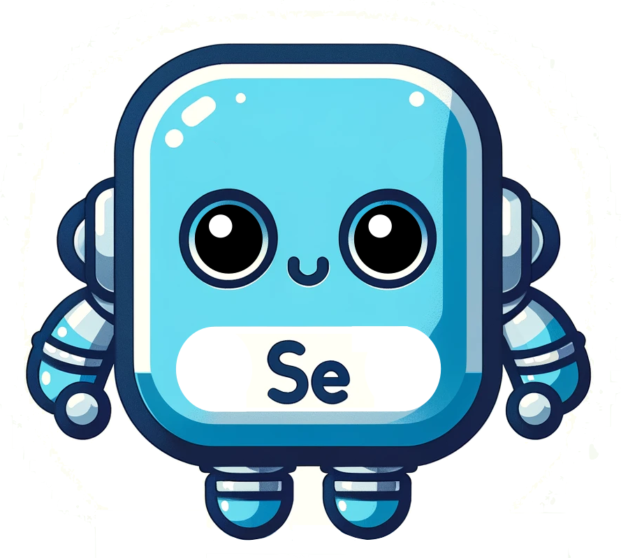

<p align="center">

</p>

# Selenobot


## Requirements

Prior to installing `selenobot`, you must have a version of Python, as well as Miniconda or Anaconda to manage the Python environment. For performing homology clustering on the sequence data, you must also have the CD-HIT (V 4.8.1) tool installed. This software can be downloaded at [this link](https://sites.google.com/view/cd-hit). 

## Installation

First, create a new conda environment which runs the latest version of Python (3.11.5 at the time of writing). Then activate the environment. 
```
conda create -n selenobot python=3.11.5
conda activate selenobot
```
Clone the `selenobot` repository into the current working directory. 
```
git clone https://github.com/pipparichter/selenobot.git
```
Use `pip` to install the `selenobot` package into the `selenobot` environment. This should also install all Python dependencies into the environment.  
```
cd selenobot 
pip install . 
```

## Notebooks

In the `/notebooks` subdirectory are Jupyter notebooks for setting up datasets, training and testing the model, as well as the process used to independently validate the model's predictions. If you want to run these notebooks, be sure to follow the installation instructions above to make sure you have all necessary dependencies and software installed.

1. `setup.ipynb` describes the set-up procedure for the training, test, and validation datasets, and provides code for replicating the procedure if desired. 
2. `training.ipynb` contains code walking through how the Selenobot PLM classifier is trained on the datasets created using the procedure described in `setup.ipynb`
3. `testing.ipynb` contains code walking through how the Selenobot PLM classifier is tested using datasets created using the procedure described in `setup.ipynb`.
4. `validation.ipnyb` contains code for validating the Selenobot on example genomes (we used E. coli strain K-12 substrain MG1655, but the code is generalizable to other complete genome assemblies).


